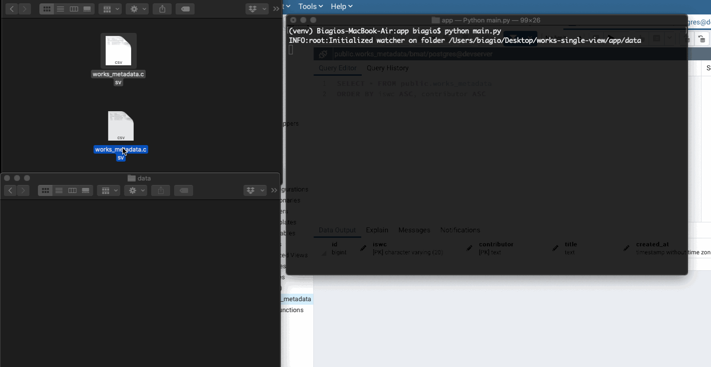

# works-single-view

This is the repository for the first part of the test assigned to me by BMAT. 

Once started, the software:
1) processes every csv file inside the data directory
2) waits for new csv files created inside the same directory

Further details regarding the file processing are provided in the answers section.

An example of the workflow:



##Dev Dependencies

- Python 3.7.7
- watchdog
- pandas
- numpy
- psycopg2

## Setup

1) Create a virtual environment

``` 
python3 -m venv <env_name> 
``` 

2) Activate it:

``` 
source app/<env_name>/bin/activate 
``` 

3) Install the dependencies in the requirements.txt file:
``` 
pip3 install -r app/requirements.txt 
``` 

4) (Optional) Set your own configuration in the app/config.py file; leave the defaults if you run the postgres image I provided

### Database

- Option 1: Run the postgres db as a Docker container using the compose file that I provided
- Option 2: Work on your own db; here I provide the SQL instruction to create the table used by the software
``` 
CREATE TABLE public.works_single_view
(
    id bigint NOT NULL DEFAULT nextval('works_single_view_id_seq'::regclass),
    iswc character varying(20) COLLATE pg_catalog."default",
    contributors text[] COLLATE pg_catalog."default",
    title text COLLATE pg_catalog."default",
    created_at timestamp without time zone DEFAULT now(),
    modified_at timestamp without time zone DEFAULT now(),
    CONSTRAINT works_single_view_pkey PRIMARY KEY (id),
    CONSTRAINT iswc UNIQUE (iswc)
)
``` 

## Run

Launch it with the command:
``` 
python3 main.py 
``` 

## Answers to questions

1) <b>Describe briefly the matching and reconciling method chosen.</b>

    1) The csv file is read with the pandas library, extracting only the columns 'iswc', 'contributors' and 'title'.
    2)
    3)
    4)
<br>

2) <b>We constantly receive metadata from our providers, how would you automatize the process?</b>
    <br>
    The provided solution can be considered already automatic as long as everything runs locally, i.e. on a single machine. However, given that the providers are external actors and can have different requirements, the things that I would do to turn the current implementation into a reliable automatic solution are the following: 
    
    1) I would discuss with the provider the possibility to use a file sharing service (like Google Drive, Dropbox or S3 on AWS) or an FTP server
    2) instead of placing the file containing the metadata on a local folder, the provider would upload it on such a service (let's call it shared folder) following a given time schedule, for example each day at the same hour. 
    3) I would modify the observation part of my solution, changing from a file system based polling to a set of authorized API requests to the shared folder; in particular, the software would: 
        1) list all csv files contained in the shared folder
        2) download and process only the files created in the last 24 hours 
    4) I would sync the activation of the metadata ingestion according to the time schedule set by the provider; moreover, it would be added as a configurable parameter inside the settings as well as the parameters necessary to communicate with the shared folder 